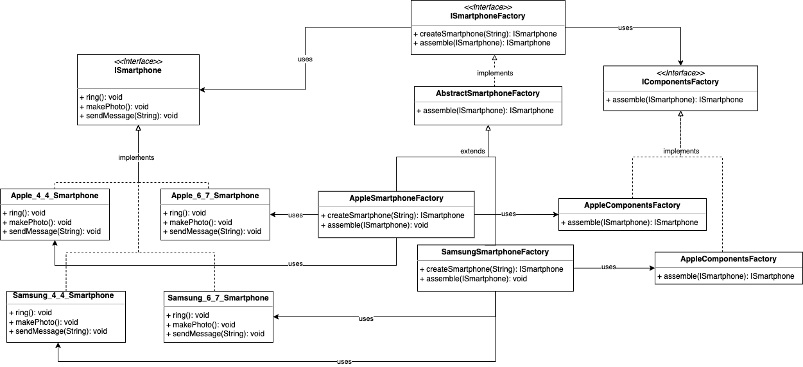

# Abstract Factory Pattern

## Definition

Provides an interface for creating families of related or dependent objects without specifying their concrete classes.

## Example

Consider a smartphone:

 ```java
/**
 * Definition of an ISmartPhone
 */
public interface ISmartphone {

    /**
     * Rings.
     */
    void ring();

    /**
     * Makes a photo.
     */
    void makePhoto();

    /**
     * Sends a text message.
     *
     * @param message the text message;
     */
    void sendMessage(String message);

}
 ```

and a smartphone maker company (interface + base abstract class). A company creates a phone and assembles it: 

```java
/**
 * Definition of a {@link ISmartphone} factory.
 */
public interface ISmartphoneFactory {

    /**
     * Factory method that creates a smartphone.
     *
     * @param size the size of the phone.
     * @return the phone.
     */
    ISmartphone createSmartphone(String size);

...

    /**
     * Assembles a phone using a component factory.
     *
     * @param phone             the phone to assemble
     * @param componentsFactory the component factory
     */
    protected ISmartphone assemble(ISmartphone phone, IComponentsFactory componentsFactory) {
        componentsFactory.getBattery();
        componentsFactory.getCPU();
        componentsFactory.getRAM();
        componentsFactory.getScreen();
        // assembles the phone
        return phone;
    }
}
```

Let's implement a smartphone company. This class will contain the references to the concrete phone classes. 
Such (level 1) factory object will decide which smartphone to create, depending on the size given as input. 
Not just that: in phone creation, the assembling part is implemented. To assemble a phone, each factory needs a 
components factory instance. The instance varies depending on the brand, obviously. So the (level2) componentsFactory is 
defined by the interface IComponentsFactory: 

```java
/**
 * Implementation of {@link ISmartphoneFactory}.
 */
public class AppleSmartphoneFactory extends AbstractSmartphoneFactory {

    @Override
    public ISmartphone createSmartphone(String size) {

        IComponentsFactory componentsFactory = getComponentFactory(APPLE_COMPONENTS);

        if (size.equals(ISmartphoneFactory._4_4_INCHES)) {
            final Apple_4_4_Smartphone smartphone = new Apple_4_4_Smartphone();
            return assemble(smartphone, componentsFactory);
        } else if (size.equals(ISmartphoneFactory._6_7_INCHES)) {
            final Apple_6_7_Smartphone smartphone = new Apple_6_7_Smartphone();
            return assemble(smartphone, componentsFactory);
        } else {
            throw new RuntimeException("not a valid size");
        }
    }
}
```

```java
/**
 * Definition of a component provider.
 */
public interface IComponentsFactory {

    /**
     * Provides a CPU.
     *
     * @return the CPU.
     */
    String getCPU();

    /**
     * Provides a touchscreen.
     *
     * @return the touchscreen.
     */
    String getScreen();

    /**
     * Provides a RAM.
     *
     * @return the RAM.
     */
    String getRAM();

    /**
     * Provides a battery.
     *
     * @return the battery.
     */
    String getBattery();
}
```

```java
public abstract class AbstractSmartphoneFactory implements ISmartphoneFactory {

...

    protected IComponentsFactory getComponentFactory(String brand) {
        if (brand.equals(APPLE_COMPONENTS)) {
            return new AppleComponentsFactory();
        } else if (brand.equals(SAMSUNG_COMPONENTS)) {
            return new SamsungComponentsFactory();
        }
        throw new RuntimeException("component factory not found");
    }

...

}
```

Let's check the smartphone classes created by the abstract factory:

```java
    public static void main(String[] args) {

        ISmartphoneFactory appleFactory = new AppleSmartphoneFactory();

        final ISmartphone apple_4_4_smartphone = appleFactory.createSmartphone(_4_4_INCHES);
        System.out.println("Apple ISmartPhone implementation of 4.4 inches smartphone:" + apple_4_4_smartphone.getClass());
        assert apple_4_4_smartphone.getClass() == Apple_4_4_Smartphone.class;

        final ISmartphone apple_6_7_smartphone = appleFactory.createSmartphone(_6_7_INCHES);
        System.out.println("Apple ISmartPhone implementation of 6.7 inches smartphone:" + apple_6_7_smartphone.getClass());
        assert apple_6_7_smartphone.getClass() == Apple_6_7_Smartphone.class;

        ISmartphoneFactory samsungFactory = new SamsungSmartphoneFactory();

        final ISmartphone samsung_4_4_smartphone = samsungFactory.createSmartphone(_4_4_INCHES);
        System.out.println("Samsung ISmartPhone implementation of 4.4 inches smartphone:" + samsung_4_4_smartphone.getClass());
        assert samsung_4_4_smartphone.getClass() == Samsung_4_4_Smartphone.class;

        final ISmartphone samsung_6_7_smartphone = samsungFactory.createSmartphone(_6_7_INCHES);
        System.out.println("Samsung ISmartPhone implementation of 6.7 inches smartphone:" + samsung_6_7_smartphone.getClass());
        assert samsung_6_7_smartphone.getClass() == Samsung_6_7_Smartphone.class;
    }
```

## Object Oriented Principles enforced

* Encapsulate what varies
* Program to intefaces, not implementations
* Dependency inversion principles: high level components should not depend on low level components. Instead, both shuold
depend on abstractions.

## Class diagram


