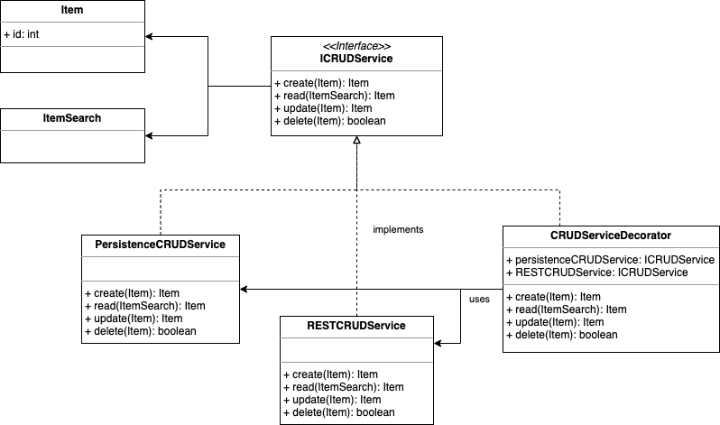

# Decorator Pattern

## Definition

The decorator Pattern attaches additional responsibilities to an object dynamically. Decorators provide a flexible 
alternative to subclassing for extending functionally.

## Example

A simple Service like **ICRUDService** can have different implementations. One implementation can be **PersistenceCRUDService**, 
which deals with persistence, while **RESTCRUDService** deals with a remote representation of the resource.
In order to wrap both service functionalities in a common class, without rewriting code and preserving the interface
contract compliancy, it's possible to apply the decorator pattern.
 
The ICRUDService interface:
```java
/**
 * Definition of a simple CRUD service
 */
public interface ICRUDService {
    /**
     * Returns the created item
     *
     * @param item the created item
     * @return
     */
    Item create(Item item);

    /**
     * Reads an object from datasource, given search input parameter
     *
     * @param itemSearch item search
     * @return The read item
     */
    Item read(ItemSearch itemSearch);

    /**
     * Updates an item.
     *
     * @param item The item to update
     * @return The updated item
     */
    Item update(Item item);

    /**
     * Deletes an item.
     *
     * @param item item to delete
     * @return true if ok, false otherwise.
     */
    boolean delete(Item item);
}
```

Two initial implementations: 

```java


/**
 * Persistence implementation of ICRUDService
 */
public class PersistenceCRUDService implements ICRUDService {
    @Override
    public Item create(Item item) {
        System.out.println("Item saved in database");
        return item;
    }

    @Override
    public Item read(ItemSearch itemSearch) {
        System.out.println("Item fetched from database");
        return new Item();
    }

    @Override
    public Item update(Item item) {
        System.out.println("Item updated in database");
        return item;
    }

    @Override
    public boolean delete(Item item) {
        System.out.println("Item deleted from database");
        return true;
    }
}


/**
 * REST implementation of ICRUDService.
 */
public class RESTCRUDService implements ICRUDService {

    @Override
    public Item create(Item item) {
        System.out.println("Item saved in remote server");
        return item;
    }

    @Override
    public Item read(ItemSearch itemSearch) {
        System.out.println("Item fetched from remote server");
        return new Item();
    }

    @Override
    public Item update(Item item) {
        System.out.println("Item updated in remote server");
        return item;
    }

    @Override
    public boolean delete(Item item) {
        System.out.println("Item deleted from remote server");
        return true;
    }
}
```

Finally the Decorator implementation. Note that this class does not inherit any of previous classes, yet takes advantage
of both implementations:

```java
/**
 * Decorator of ICRUDService where both existing implementations are involved.
 */
public class CRUDServiceDecorator implements ICRUDService {

    private ICRUDService persistenceCRUDService = new PersistenceCRUDService();
    private ICRUDService restCRUDService = new RESTCRUDService();

    @Override
    public Item create(Item item) {
        final Item persistedItem = persistenceCRUDService.create(item);
        final Item RESTItem = restCRUDService.create(persistedItem);
        return RESTItem;
    }

    @Override
    public Item read(ItemSearch itemSearch) {
        Item item = persistenceCRUDService.read(itemSearch);
        if (item == null) {
            item = restCRUDService.read(itemSearch);
        }
        return item;
    }

    @Override
    public Item update(Item item) {
        final Item persistedItem = persistenceCRUDService.create(item);
        final Item RESTItem = restCRUDService.create(persistedItem);
        return RESTItem;
    }

    @Override
    public boolean delete(Item item) {
        // otherwise, implement a rollback
        return persistenceCRUDService.delete(item) && restCRUDService.delete(item);
    }
}
```

Test the different implementations:
```java

    public static void main(String[] args) {

        // Call persistence crud service
        System.out.println("Calling persistence CRUD service ... ");
        ICRUDService persistenceCRUDService = new PersistenceCRUDService();
        runService(persistenceCRUDService);

        // Call REST crud service
        System.out.println("\n Calling REST CRUD service ...");
        ICRUDService restCRUDService = new RESTCRUDService();
        runService(restCRUDService);

        // Call Decorator crud service
        System.out.println("\n Calling decorator CRUD service ...");
        ICRUDService decoratorCRUDService = new CRUDServiceDecorator();
        runService(decoratorCRUDService);
    }

    private static void runService(ICRUDService crudService) {
        crudService.create(new Item());
        crudService.read(new ItemSearch());
        crudService.update(new Item());
        crudService.delete(new Item());
    }
```

Print result. We can notice that when Bitcoin observer get removed, no notification about bitcoin is printed, eventhough
the provider will stop a couple of seconds after.

```
Calling persistence CRUD service ... 
Item saved in database
Item fetched from database
Item updated in database
Item deleted from database

 Calling REST CRUD service ...
Item saved in remote server
Item fetched from remote server
Item updated in remote server
Item deleted from remote server

 Calling decorator CRUD service ...
Item saved in database
Item saved in remote server
Item fetched from database
Item saved in database
Item saved in remote server
Item deleted from database
Item deleted from remote server

```
## Object Oriented Principles enforced

* Favor composition over inheritance
* Open/closed principle: Classes should be open for extension but closed for modification

## Class diagram


