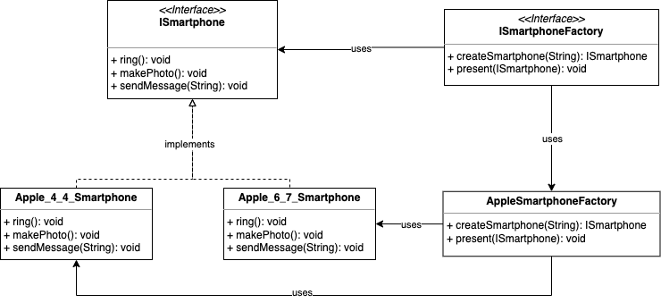

# Factory Pattern

## Definition

Defines an interface for creating an object, but lets subclasses decide which class to instantiate. Factory Method lets 
a class defer instantiation to subclasses.

## Example

Consider a smartphone:

 ```java
/**
 * Definition of an ISmartPhone
 */
public interface ISmartphone {

    /**
     * Rings.
     */
    void ring();

    /**
     * Makes a photo.
     */
    void makePhoto();

    /**
     * Sends a text message.
     *
     * @param message the text message;
     */
    void sendMessage(String message);

}
 ```

and a smartphone maker company. A company creates a phone and presents it to the world: 

```java
/**
 * Definition of a {@link ISmartphone} factory.
 */
public interface ISmartphoneFactory {

    /**
     * Factory method that creates a smartphone.
     *
     * @param size the size of the phone.
     * @return the phone.
     */
    ISmartphone createSmartphone(String size);
    
    /**
     * Phone presentation.
     *
     * @param phone the phone to present.
     */
    void present(ISmartphone phone);
}
```

Let's implement a smartphone company. This class will contain the references to the concrete classes. Such factory object
will decide which smartphone to create, depending on the size given as input. 
The key point here is that ISmartphoneFactory delegates to its subclasses the actual creation of the phones, thus not 
implementing nor depending on any concrete class.

```java
/**
 * Implementation of {@link ISmartphoneFactory}.
 */
public class AppleSmartphoneFactory implements ISmartphoneFactory {

    @Override
    public ISmartphone createSmartphone(String size) {
        if (size.equals(ISmartphoneFactory._4_4_INCHES)) {
            return new Apple_4_4_Smartphone();
        } else if (size.equals(ISmartphoneFactory._6_7_INCHES)) {
            return new Apple_6_7_Smartphone();
        } else {
            throw new RuntimeException("not a valid size");
        }
    }
}
```

Let's check the smartphone classes created by the factory:

```java
          
    public static void main(String[] args) {

        ISmartphoneFactory factory = new AppleSmartphoneFactory();

        final ISmartphone _4_4_smartphone = factory.createSmartphone(_4_4_INCHES);
        System.out.println("Apple ISmartPhone implementation of 4.4 inches smartphone:" + _4_4_smartphone.getClass());
        assert _4_4_smartphone.getClass() == Apple_4_4_Smartphone.class;

        final ISmartphone _6_7_smartphone = factory.createSmartphone(_6_7_INCHES);
        System.out.println("Apple ISmartPhone implementation of 6.7 inches smartphone:" + _6_7_smartphone.getClass());
        assert _6_7_smartphone.getClass() == Apple_6_7_Smartphone.class;
    }
```

## Object Oriented Principles enforced

* Encapsulate what varies
* Program to intefaces, not implementations
* Dependency inversion principles: high level components should not depend on low level components. Instead, both shuold
depend on abstractions.

## Class diagram


