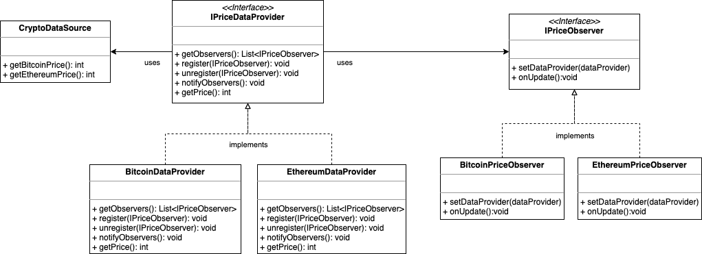

# Observer Pattern

## Definition

Defines a one-to-many dependency between objects so that when one object changes state, all its dependents are notified 
and updated automatically.

## Example

Consider a provider of crypto coin prices. This provider gives real time market prices of Bitcoin and Ethereum whenever they 
change. We want a structure to react to those price variations, e.g. printing the price. We want also the objects that 
observe the price, to have an independent lifecycle from the provider, to be interchangeable and extendable.

This excludes any observer code addition to the provider itself. 

A simple solution would be to create some observers and let them
poll the provider. But since we don't know how often the provider is gonna give us new prices, we could end up doing a 
lot of unnecessary calls to the provider.

So we will let the provider take note of any observer and update them when necessary.
 Let's define an observer:
```java
/**
 * Definition of a price observer.
 */
public interface IPriceObserver {
    /**
     * Sets the provider of data, where it will fetch updated data.
     *
     * @param dataProvider the data provider.
     */
    void setDataProvider(@NonNull IPriceDataProvider dataProvider);

    /**
     * called from provider whenever a new value is provided.
     */
    void onUpdate();
}
```

An observer gets waked via **onUpdate()** method by the provider, whenever the price changes. Notice that **onUpdate()** 
does not carry an information about price. This is because the observer can decide whether it needs the updated price
or not. In a situation where the observer has no way to present the new data, and the data is not small as a price, we 
would have avoided information transmission to discard.

The provider takes care of register or unregister each observer, notifies all the observers and provide the price data 
whenever needed: 

```java
/**
 * Provider of data. A provider has a register of observers which it notifies at a specific pace.
 */
public interface IPriceDataProvider {
    /**
     * Gets the observers.
     *
     * @return The observers.
     */
    List<IPriceObserver> getObservers();

    default void register(@NonNull IPriceObserver observer) {
        getObservers().add(observer);
        observer.setDataProvider(this);
    }

    /**
     * Unregister observer.
     *
     * @param observer
     */
    default void unregister(@NonNull IPriceObserver observer) {
        getObservers().remove(observer);
        System.out.println("Observer unregistered: " + observer);
    }

    /**
     * Notifies observers calling IPriceObserver.onUpdate().
     */
    default void notifyObservers() {
        getObservers().forEach(IPriceObserver::onUpdate);
    }

    /**
     * Returns the update value to the observer, whenever observer needs it.
     *
     * @return The price
     */
    int getPrice();
}
```

Let's create providers and observers, check the obervers behavior and try to unregister an observer:  

```java
        // Create the providers
        var bitcoinProvider = new BitCoinDataProvider();
        var ethereumProvider = new EthereumDataProvider();

        // Create the observers
        IPriceObserver bitcoinObserver = new BitcoinPriceObserver();
        IPriceObserver ethereumObserver = new EthereumPriceObserver();

        // Start providers
        ExecutorService executor = Executors.newFixedThreadPool(2);
        executor.submit(bitcoinProvider.startProvideData());
        executor.submit(ethereumProvider.startProvideData());

        // Add observers to the providers
        bitcoinProvider.register(bitcoinObserver);
        ethereumProvider.register(ethereumObserver);

        //Wait a second and unregister ethereum observer
        Thread.sleep(1000);
        bitcoinProvider.unregister(bitcoinObserver);

        // Terminate execution
        Utils.shutdownIn(executor, 4);
```

Print result. We can notice that when Bitcoin observer get removed, no notification about bitcoin is printed, eventhough
the provider will stop a couple of seconds after.

```
Bitcoin price is: 38549
Ethereum price is: 2390
Bitcoin price is: 10966
Bitcoin price is: 27594
Ethereum price is: 1727
Bitcoin price is: 27798
Bitcoin price is: 14516
Bitcoin price is: 10052
Bitcoin price is: 22843
Bitcoin price is: 32417
Bitcoin price is: 39851
Ethereum price is: 633
Bitcoin price is: 20580
Bitcoin price is: 30189
Bitcoin price is: 25905
Bitcoin price is: 7724
Bitcoin price is: 17197
Bitcoin price is: 4780
Bitcoin price is: 35209
Ethereum price is: 2172
Observer unregistered: com.stefanobiasu.designpatterns.observer.observers.BitcoinPriceObserver@1a407d53
Ethereum price is: 2146
Ethereum price is: 1145
Ethereum price is: 1893
Ethereum price is: 2897
Ethereum price is: 540
Ethereum price is: 2824
Ethereum price is: 193
Ethereum price is: 1417
Ethereum price is: 2998
Ethereum price is: 1358
Ethereum price is: 908
Ethereum price is: 2954
Ethereum price is: 2952
Ethereum price is: 2619
Ethereum price is: 2296
Ethereum price is: 588
Ethereum price is: 2508
Ethereum price is: 2807
Ethereum price is: 2801
Completed to provide ethereum price samples
Completed to provide bitcoin price samples

```
## Object Oriented Principles enforced

* Encapsulate what varies
* Favor composition over inheritance
* Program to intefaces, not implementations
* Strive for loosely coupled designs between objects that interact.

## Class diagram


