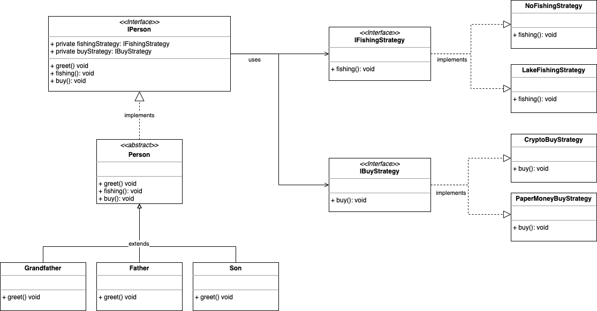

# Strategy Pattern

## Definition

Defines a family of algorithms, encapsulates each one, and makes them interchangeable. Strategy lets the algorithm vary 
independently from clients that use it.

## Example explanation

Consider 
* a **IPerson** interface that represents a person, 
* three common actions for each person: **greet**, go **fishing**, **buy** things, 
* and three implementations of **IPerson**: **Grandfather**, **Father** and **Son**.

```java
/**
 * Generic inteface defining person actions.
 */
public interface IPerson {

    /**
     * Fishing action.
     */
    void fishing();

    /**
     * Buy action
     */
    void buy();

    /**
     * Greet action.
     */
    void greet();
}
```

All people can perform potentially all actions defined in the interface, and it's probable that grandfather teaches 
father, as father teaches son. It seems logic to implement a hierarchy between the classes where son inherits 
the knowledge (the actions) from father, which in turn inherits from grandfather, but reality can be more complex. For 
example:
* **Grandfather** and **Son** are able to go fishing, but **Father** did not learn yet,
* they all buy things with paper money, but **Father** plans to open a Crypto wallet and buy with crypto next month.

In this scenario, it's impossible to take advantage of hierarchy among classes. We would end up duplicating code in 
**Grandfather** and **Son**.
We must separate the concept of hierarchy among persons from the different action implementations.
Let's define a strategy for each action:

```java
/**
 * Definition of how to buy things.
 */
public interface IBuyStrategy {
    /**
     * Buy action.
     */
    void buy();
}

/**
 * Definition of how to go fishing.
 */
public interface IFishingStrategy {
    /**
     * Fishing action.
     */
    void fishing();
}
```

and a base class which calls a different strategy for each action:

```java
/**
 * Abstract implementation of IPerson.
 */
@Slf4j
public abstract class Person implements IPerson {

    protected @NonNull IFishingStrategy fishingStrategy;

    protected @NonNull IBuyStrategy buyStrategy;

    @Override
    public void fishing() {
        fishingStrategy.fishing();
    }

    @Override
    public void buy() {
        buyStrategy.buy();
    }
    
    // ...

}
```

finally, **Grandfather**, **Father** and **Son** will have their own strategy choice:

```java
/**
 * Grandfather.
 */
public class Grandfather extends Person {

    /**
     * Constructor.
     */
    public Grandfather() {
        fishingStrategy = new LakeFishingStrategy();
        buyStrategy = new PaperMoneyBuyStrategy();
    }

    // ...

}

/**
 * Father.
 */
public class Father extends Grandfather {

    /**
     * Constructor.
     */
    public Father() {
        fishingStrategy = new NoFishingStrategy();
        buyStrategy = new PaperMoneyBuyStrategy();
    }

    // ...

}

/**
 * Son.
 */
public class Son extends Person {

    /**
     * Constructor.
     */
    public Son() {
        fishingStrategy = new LakeFishingStrategy();
        buyStrategy = new PaperMoneyBuyStrategy();
    }

    // ...

}

``` 

Let's print initial situation, and final situation after strategy change:

```java
        var grandfather = new Grandfather();
        var father = new Father();
        var son = new Son();
        Stream.of(grandfather, father, son).forEach(person -> {
            person.greet();
            person.fishing();
            person.buy();
        });

        // Let's change the father buy strategy, enabling crypto payments
        System.out.println("Changing father's buy strategy ... ");
        father.setBuyStrategy(new CryptoBuyStrategy());
        father.greet();
        father.fishing();
        father.buy();
```

Print result:

```
Hi, I'm a grandfather
I go fishing at lake,
I pay only with paper money.
Hi, I'm a father
I don't know how to go fishing,
I pay only with paper money.
Hi, I'm a son.
I go fishing at lake,
I pay only with paper money.
Changing father's buy strategy ... 
Hi, I'm a father
I don't know how to go fishing,
I pay everything with crypto currencies. 
```

## Class diagram


